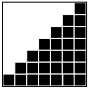
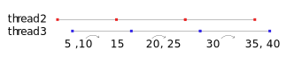

//Marlon Mueller-Soppart
//20200321

{{TOC}}

# Problem 1

Find the sum of all the multiples of 3 or 5 below 1000.

### P1 Visualized

```
//the pattern becomes clear

Set of 5s:         5         10             15 
Set of 3s:     3     6     9       12       15       18    
Set of NN: 1 2 3 4 5 6 7 8 9 10 11 12 13 14 15 16 17 18 ...

               3 + 5+6  +  9+10  + 12   +   15   +   18 ... -> answer
       
```

> The problem becomes 3s + 5s - 15s 


## Problem 1 Decomposed

I see two concepts applied in solving the problem.

* multiples
* Sum of arithmetic sequence

### multiples

To determine multiples of number (let's say n), one can multiply n by any integer yeilding a new multiple. Working backwards, one can divide a number by the original number n, if the result is a whole number then it's a multiple. This translates to using mod(num, n) = 0. This is a surefire check but it is not necessarily the most efficient. 

#### 5

A multiple of 5 will always end in 0 or 5.

#### 3 

The sum of its digits is a multiple of 3. (I wonder how much faster this would be than division.)

#### 15

Apply both the rules for 3 and 5. They must both apply as 15 is a multiple of 3 and 5. 

### Sum of arithmetic sequence

The core problem of summing the arithmetic sequence of 3s, 5s, and NNs are the same things. Watch.

**3s**
(3 + 6 + 9 + 12 + 15 + 18 + 21 + ...)
3 (1 + 2 + 3 + 4 + 5 + 6 + 7 + ...)

**5s**
(5 + 10 + 15 + 20 + 25 + ...)
5 (1 + 2 + 3 + 4 + 5 + ...)

How the heck does one figure out the sum of NNs? This is also the same as asking how does one find the area/count the blocks of the shape below.


Both seem equally difficult. 

Now look at these. It is actually a big give away to think about the shape in the context of a square, but some people just hand out the equation.




An interesting observation is that the sequence 1 + 2 in a 2x2 square fills up 2/3(.66) of the area. For the sequence 1 + 2 + 3 + 4 + 5 + 6 + 7 in a 7x7 square, it fills 29/49(.59) of the blocks. The trend is clear. As we have a longer sequence, the area of the blocks approaches 1/2. 


A take away is that as the sequence gets larger and larger for a sequence [1..n], the function, $\frac{n^2}{2}$, becomes more correct in its ability to estimate.

Can we do better? Yes. I will give away the twist. A rectangle will save us. 

![blocks from seq [1..2] take up half of 2x3 rectangle](img/sum3_ans.svg)

![blocks from seq [1..7] take up half of 7x8 rectangle](img/sum2_ans.svg)

Do you see it? $\frac{n^2}{2}$ was close. Instead, we were off by a column. The correct function for getting the area/sequence is $\frac{n^2 + n}{2}$ or more commonly, $\frac{n \ (n+1)}{2}$. I like $$\frac{n^2 + n}{2}$$ because it clearly shows that as n gets larger n^2 will dominate the n term at the beginning. $$\frac{n \ (n+1)}{2}$$ more clearly shows a rectangle. 

With this short cut, a computer isn't necessary for this problem.

This is not the standard approach to explaining this concept. Many opt to use the story of Gauss being a very smart child. 

[9 year old Gauss trick](https://www.coolmath.com/algebra/19-sequences-series/06-gauss-problem-arithmetic-series-01)

## Methods

This section will outline how I approach the problems. All algorithms will be O(n).

### 1. sets

algorithm

```
1.1. let 3s be the set of multiples of 3s less than 1000
2.1. let 5s be the set of multiples of 5s less than 1000
3.1. let 3sMinus5s be the set difference of 3s - 5s
3.2. sum(3sMinus5s) + sum(5s)
```


### 2. mod 

algorithm

```
1. let acc = 0 (an accumulator)
2. for each $\N$ less than 1000
	3. if the natural number n satisfies (n mod 3 == 0) or (n mod 5 == 0) then add n to acc
	4. else ignore the number
5. return acc
```

### 3. multithreading 

This problem can be solved by many, many threads. Here is an example with three. Thread two and thread three jump over the multiples of 3, so the overlap does not need to be retroactively addressed. This method involves a good deal of hardcoding.



algorithm

```
1. let MAX = 1000

//thread one
2. set for loop to jump by three, start at 3, and stop before 1000
		3. add up all values that the for loop lands on 

//thread two
4. set for loop to jump by 10, start at 5, and stop before 1000
		5. add up all values

//thread t
6. set for loop to jump by 10, start at 10, and stop before 1000
    7. add up all values
    
8. Sum the outputted values by all threads
```


### 4. Function

$$\frac{n \ (n+1)}{2}$$